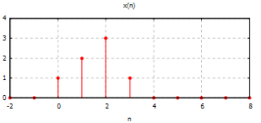
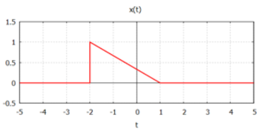
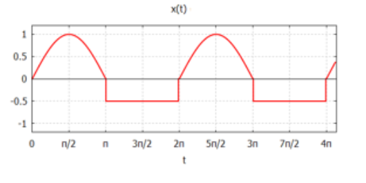

---
format:
  pdf:
    documentclass: llncs
    classoption: runningheads
    pdf-engine: pdflatex
    number-sections: true
    number-depth: 3
---

\title{Lab 2}
\titlerunning{Lab 2}

\author{Vladyslav Humeniuk}
\authorrunning{Vladyslav Humeniuk}
\institute{}
\maketitle

## Zadanie

Należy wykonać dokładny szkic poniższych sygnałów dyskretnych (tzn. opisać osie, oraz wszystkie punkty charakterystyczne wykresu) (6 pkt.)

a. $x(n)=\sum_{k=0}^{\infty}(-1)^{k}\delta(n-3k)$, gdzie $\delta$ jest funkcją delta-Diraca
b. $x(n)=(-1)^{n}u(-n-4)$, gdzie $u(n)$ jest funkcją skoku jednostkowego Heaviside'a
c. $x(n)=cos(\frac{\pi}{2}n)u(n+3)u(-n-5)$
d. $x(n)=2^{n}\delta(n-4)$
e. $x(n)=\sum_{k=0}^{\infty}4\delta(n-3k-1)$
f. $x(n)=cos(\frac{\pi}{4})u(n)$

### a

```{python}
import numpy as np
import matplotlib.pyplot as plt

n = np.arange(-10, 4)
x = np.zeros_like(n, dtype=float)

valid_indices = n <= -4

x[valid_indices] = (-1.0) ** n[valid_indices]

plt.figure(figsize=(8, 4))
plt.stem(n, x, basefmt="black")

plt.title(r"Discrete signal $x(n) = (-1)^n u(-n-4)$")
plt.xlabel("n (time)")
plt.ylabel("x(n)")
plt.xticks(n)
plt.grid(True, linestyle='--', alpha=0.7)

plt.savefig("plot_b.png")
plt.show()
```

### b

```{python}
import numpy as np
import matplotlib.pyplot as plt

# Define the discrete time vector 'n' (e.g., from -2 to 10)
n = np.arange(-2, 11)

# Initialize the signal array 'x' with zeros
x = np.zeros_like(n)

# The delta function only "fires" when n = 3k (which means n >= 0 and n is a multiple of 3)
# So, we find all indices where n >= 0 AND n % 3 == 0
valid_indices = (n >= 0) & (n % 3 == 0)
# For those valid points, k = n / 3. The amplitude is (-1)^k
k = n[valid_indices] // 3
x[valid_indices] = (-1.0) ** k

# Plot the discrete signal using plt.stem()
# basefmt="black" makes the horizontal axis line black
plt.stem(n, x, basefmt="black")

# Formatting the plot to make it look like a proper textbook sketch
plt.title(r"Discrete Signal $x(n) = \sum (-1)^k \delta(n-3k)$")
plt.xlabel("n (discrete time)")
plt.ylabel("x(n)")
plt.xticks(n)  # Force ticks at every integer
plt.grid(True, linestyle='--', alpha=0.7)

plt.savefig("plot.png")
```

### c

```{python}
import numpy as np
import matplotlib.pyplot as plt

n = np.arange(-10, 10)
x = np.zeros_like(n, dtype=float)

valid_indices = (n <= -5) & (n >= -3)

x[valid_indices] = np.cos(np.pi / 2 * n[valid_indices])

plt.figure(figsize=(8, 4))
plt.stem(n, x, basefmt="black")

plt.title(r"Discrete signal $x(n) = \cos(\frac{\pi}{2}n) u(n+3) u(-n-5)$")
plt.xlabel("n (discrete time)")
plt.ylabel("x(n)")
plt.xticks(n)
plt.grid(True, linestyle='--', alpha=0.7)

plt.savefig("plot_c.png")
plt.show()
```

### d

```{python}
import numpy as np
import matplotlib.pyplot as plt

n = np.arange(-10, 10)

x = np.zeros_like(n)

valid_indices = (n == 4)
x[valid_indices] = 2 ** 4

plt.stem(n, x, basefmt="black")

plt.title(r"Discrete Signal $x(n) = 2^n*\delta(n-4)$")
plt.xlabel("n (discrete time)")
plt.ylabel("x(n)")
plt.xticks(n)  # Force ticks at every integer
plt.grid(True, linestyle='--', alpha=0.7)

plt.savefig("plot.png")
```

### e

```{python}
import numpy as np
import matplotlib.pyplot as plt

n = np.arange(-10, 10)

x = np.zeros_like(n)

valid_indices = (n>=0) & ((n-1)%3==0)
k = n[valid_indices]//3
x[valid_indices] = 4

plt.stem(n, x, basefmt="black")

plt.title(r"Discrete Signal $x(n) = \sum 4*\delta(n-3k-1)$")
plt.xlabel("n (discrete time)")
plt.ylabel("x(n)")
plt.xticks(n)  # Force ticks at every integer
plt.grid(True, linestyle='--', alpha=0.7)

plt.savefig("plot.png")
```

### f

```{python}
import numpy as np
import matplotlib.pyplot as plt

n = np.arange(-10, 10)
x = np.zeros_like(n, dtype=float)

valid_indices = (n >= 0)

x[valid_indices] = np.cos(np.pi / 4 * n[valid_indices])

plt.figure(figsize=(8, 4))
plt.stem(n, x, basefmt="black")

plt.title(r"Discrete signal $x(n) = \cos(\frac{\pi}{4}) u(n)$")
plt.xlabel("n (discrete time)")
plt.ylabel("x(n)")
plt.xticks(n)
plt.grid(True, linestyle='--', alpha=0.7)

plt.savefig("plot_c.png")
plt.show()
```

## Zadanie

Dany jest dyskretny w dziedzinie czasu system LTI (liniowy, stacjonarny) opisywany zależnością (3 pkt.)

$$
y(n)=x(n-5)+\frac{1}{2}x(n-7)
$$

Należy wyznaczyć odpowiedź impulsową $h(n)$ systemu.


## Zadanie

Dany jest dyskretny w dziedzinie czasu system LTI (liniowy, stacjonarny) opisywany zależnością (3 pkt.)

$$
y(n)=(-1)^{n}x(n)+2x(n-1)
$$

Wykonaj dokładny szkic sygnału wyjściowego $y(n)$ w przypadku, gdy na wejście podano sygnał $x(n)$ przedstawiony na poniższym wykresie




## Zadanie

Wykres funkcji $x(t)$ przedstawiono na poniższym rysunku. (4 pkt.)



Należy sporządzić wykresy funkcji

a. $x(2-t)$
b. $x(t-2)$
c. $x(2t+1)$
d. $x(1\frac{2}{3}-3t)$


### a

### b

### c

### d


## Zadanie

Należy obliczyć energię i moc sygnału $x(1)$ przedstawionego na poniższym rysunku (4 pkt.)



## Zadanie

Należy sporządzić wykres splotu funkcji $x(t)=tu(t)$ oraz $y(t)=u(t)$, gdzie $u(t)$ oznacza funkcję skoku jednostkowego. (10 pkt.)
